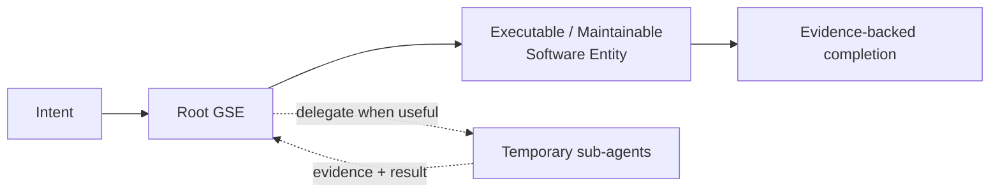

# Generative Software Engineering

**English** | [简体中文](README.zh-CN.md)

**Generative Software Engineering (GSE)** treats the unit of software work as an owned transformation from intent into a usable, maintainable software entity:

```text
Intent → Executable / Maintainable Software Entity
```

A root GSE agent owns the outcome end to end: understand the intent, inspect reality, define the result contract, implement, verify, integrate, deliver, and maintain. It may delegate independent work to temporary sub-agents when parallelism, expertise, or independent evaluation has clear value, while retaining responsibility for the final outcome.

> 中文摘要：GSE 把“软件生成”从 `Prompt → Code` 提升为 `Intent → Executable / Maintainable Software Entity`。一个根 Agent 对结果端到端负责；组织结构按任务风险动态生成；完成必须由与风险相称的真实证据证明；工程复杂度只保留当前需求和真实风险所需要的最小充分部分。



GSE is proposed and maintained by **Longbiao CHEN (龙彪)** as an open research and engineering methodology.

## The abstraction shift: from coding to outcome engineering

As coding agents make implementation increasingly cheap, the scarce engineering work moves upstream. The important questions become: **What is the goal? What constraints define the solution space? What evidence proves success? Who owns the result when the generated code is incomplete, inconsistent, or wrong?**

GSE treats code generation as one tactic inside a larger engineering loop. Code matters, but `Prompt → Code` is too small a unit of responsibility for real software work. The durable responsibility is the transformation from intent to a software entity that actually works, can be maintained, and has enough evidence to justify the claim that it is done.

| Abstraction | Primary unit | Typical stopping point | GSE view |
| --- | --- | --- | --- |
| Manual coding | Code | “I implemented it.” | Implementation is only one part of the outcome. |
| AI code generation | Prompt → Code | “The model generated a patch.” | Generation does not prove delivery. |
| Generative Software Engineering | Intent → Software Entity | Evidence-backed usable outcome | Goal, constraints, execution, verification, integration, and responsibility form one loop. |

This also changes the role of the engineer. The highest-leverage work increasingly lies in **goal definition, system design, decomposition, tool and environment design, verification, and accountability**. GSE makes that shift explicit and turns it into an engineering method rather than leaving it as an informal style of “managing coding agents.”

## Start here

- **Definition and invariants:** [`docs/SPECIFICATION.md`](docs/SPECIFICATION.md)
- **End-to-end lifecycle:** [`docs/LIFECYCLE.md`](docs/LIFECYCLE.md)
- **Dynamic agent collaboration:** [`docs/COLLABORATION.md`](docs/COLLABORATION.md)
- **Evidence-driven completion:** [`docs/EVIDENCE.md`](docs/EVIDENCE.md)
- **Minimal sufficient engineering:** [`docs/MINIMAL_SUFFICIENT_ENGINEERING.md`](docs/MINIMAL_SUFFICIENT_ENGINEERING.md)
- **Comparative research:** [`research/BENCHMARK_PROTOCOL.md`](research/BENCHMARK_PROTOCOL.md)
- **Worked examples:** [`examples/`](examples/)

## Why GSE

Agentic software development fails when code generation is mistaken for delivery. A patch can compile while the user journey is broken, a test can pass while the installed system is unhealthy, and a large multi-agent organization can add more coordination cost than engineering value.

GSE therefore centers five ideas:

1. **Outcome ownership** — one root GSE owns one software intent end to end.
2. **Recoverable lifecycle** — work progresses through explicit outcome, evidence, and handoff state rather than chat history alone.
3. **Risk-shaped collaboration** — sub-agents are created dynamically for independent work; no fixed role pipeline is required.
4. **Evidence-driven completion** — completion is claimed only when evidence covers the behavior and system qualities affected by the change.
5. **Minimal sufficient engineering** — add only the states, abstractions, tests, compatibility paths, and process needed for current requirements and demonstrated risks.

## What GSE changes

| Common stopping point | GSE completion question |
| --- | --- |
| “The code was generated.” | Is there now a usable and maintainable software outcome? |
| “The tests passed.” | Do the tests actually prove the affected user and system claims? |
| “The sub-agent finished.” | Has the root owner integrated and verified the result? |
| “We created more agents.” | Did delegation improve quality or throughput enough to repay coordination cost? |
| “We added a robust abstraction.” | Is the complexity justified by a current requirement or demonstrated risk? |

## Repository map

- [`docs/SPECIFICATION.md`](docs/SPECIFICATION.md) — normative GSE model and invariants.
- [`docs/LIFECYCLE.md`](docs/LIFECYCLE.md) — task lifecycle, outcome contract, continuation, and closure.
- [`docs/COLLABORATION.md`](docs/COLLABORATION.md) — dynamic sub-agent and concurrent-writer model.
- [`docs/EVIDENCE.md`](docs/EVIDENCE.md) — evidence hierarchy and completion gates.
- [`docs/MINIMAL_SUFFICIENT_ENGINEERING.md`](docs/MINIMAL_SUFFICIENT_ENGINEERING.md) — complexity and test-value discipline.
- [`docs/HARNESS.md`](docs/HARNESS.md) — boundary between GSE semantics and the agent harness/runtime.
- [`templates/`](templates/) — lightweight outcome, handoff, and evidence templates.
- [`examples/`](examples/) — worked examples.
- [`research/`](research/) — hypotheses, benchmark protocol, and open research questions.
- [`CONTRIBUTING.md`](CONTRIBUTING.md) and [`AGENTS.md`](AGENTS.md) — contribution and agent-working rules for this repository.

The repository name `generative-software-engineering` is an intentional three-segment kebab-name exception for this project. It does not define a general repository naming policy.

## Status

This repository is a living research and methods project. The normative surface is deliberately small. Research notes may propose changes, but only material promoted into the specification changes the current GSE contract.

The first public research release is **v0.1**. The research program is intentionally falsifiable: benchmark tasks should preserve comparable inputs, runtime/model configuration, tool access, evidence, and total participant cost.

## Citation

If GSE influences your research, engineering process, teaching, or agent design, please cite this repository. Machine-readable citation metadata is available in [`CITATION.cff`](CITATION.cff).

```bibtex
@misc{chen2026gse,
  author = {Longbiao Chen},
  title = {Generative Software Engineering},
  year = {2026},
  url = {https://github.com/longbiaochen/generative-software-engineering}
}
```

## License

GSE uses a split open license. Software, executable configuration, and agent-skill artifacts are licensed under **Apache-2.0**. Methodology prose, documentation, research material, templates, diagrams, and examples are licensed under **CC BY 4.0**. See [`LICENSE`](LICENSE) and [`LICENSES/`](LICENSES/) for the exact terms.

Contributions are welcome through issues, pull requests, and GitHub Discussions. See [`CONTRIBUTING.md`](CONTRIBUTING.md) before proposing normative changes.
