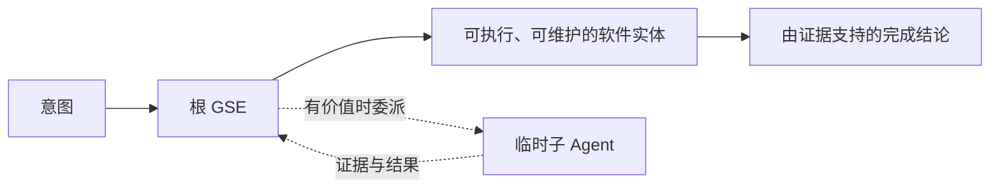

# 生成式软件工程

[English](README.md) | **简体中文**

**生成式软件工程（Generative Software Engineering，GSE）**将软件工作的基本单位定义为：由明确的责任主体，把意图转化为可用、可维护的软件实体。

```text
Intent → Executable / Maintainable Software Entity
意图 → 可执行、可维护的软件实体
```

一个根 GSE Agent 对结果端到端负责：理解意图、检查实际系统、定义结果契约、实现、验证、集成、交付和维护。当并行处理、专业能力或独立评估具有明确价值时，它可以把独立工作委派给临时子 Agent，但仍然承担最终结果的责任。



GSE 由 **Longbiao CHEN（龙彪）**提出和维护，是一项开放的研究与工程方法。

## 从这里开始

- **定义与不变量：**[`docs/SPECIFICATION.md`](docs/SPECIFICATION.md)
- **端到端生命周期：**[`docs/LIFECYCLE.md`](docs/LIFECYCLE.md)
- **动态 Agent 协作：**[`docs/COLLABORATION.md`](docs/COLLABORATION.md)
- **由证据支持的完成判定：**[`docs/EVIDENCE.md`](docs/EVIDENCE.md)
- **最小充分工程：**[`docs/MINIMAL_SUFFICIENT_ENGINEERING.md`](docs/MINIMAL_SUFFICIENT_ENGINEERING.md)
- **对比研究：**[`research/BENCHMARK_PROTOCOL.md`](research/BENCHMARK_PROTOCOL.md)
- **完整示例：**[`examples/`](examples/)

## 为什么提出 GSE

把代码生成当成交付，会导致 Agent 软件开发失败。补丁可以通过编译，用户流程却仍然不可用；测试可以通过，已安装的系统却仍然运行异常；庞大的多 Agent 组织也可能带来高于工程收益的协调成本。

因此，GSE 围绕五个核心思想展开：

1. **结果责任**——一个根 GSE 对一个软件意图端到端负责。
2. **可恢复的生命周期**——通过明确的结果、证据和交接状态推进工作，而不只依赖聊天记录。
3. **随风险调整的协作**——根据独立工作的需要动态创建子 Agent，不要求固定的角色流水线。
4. **由证据支持的完成判定**——只有证据覆盖变更所影响的行为与系统质量，才能宣告完成。
5. **最小充分工程**——只引入当前需求和已证实风险所需要的状态、抽象、测试、兼容路径与流程。

## GSE 改变了什么

| 常见的停止点 | GSE 判断是否完成的问题 |
| --- | --- |
| “代码已经生成了。” | 现在是否已经有了可用、可维护的软件结果？ |
| “测试已经通过了。” | 这些测试是否真正证明了受影响的用户行为和系统状态？ |
| “子 Agent 已经完成了。” | 根责任主体是否已经集成并验证了结果？ |
| “我们创建了更多 Agent。” | 委派带来的质量或吞吐提升，是否足以抵偿协调成本？ |
| “我们增加了一个健壮的抽象。” | 这项复杂度是否有当前需求或已证实风险作为依据？ |

## 仓库导览

- [`docs/SPECIFICATION.md`](docs/SPECIFICATION.md)——GSE 的规范模型与不变量。
- [`docs/LIFECYCLE.md`](docs/LIFECYCLE.md)——任务生命周期、结果契约、工作续接与完成判定。
- [`docs/COLLABORATION.md`](docs/COLLABORATION.md)——动态子 Agent 与并发写入者模型。
- [`docs/EVIDENCE.md`](docs/EVIDENCE.md)——证据层级与完成条件。
- [`docs/MINIMAL_SUFFICIENT_ENGINEERING.md`](docs/MINIMAL_SUFFICIENT_ENGINEERING.md)——复杂度与测试价值的约束。
- [`docs/HARNESS.md`](docs/HARNESS.md)——GSE 方法语义与 Agent 执行框架、运行时之间的边界。
- [`templates/`](templates/)——轻量的结果、交接与证据模板。
- [`examples/`](examples/)——完整示例。
- [`research/`](research/)——研究假设、基准测试协议与开放研究问题。
- [`communications/x-launch.md`](communications/x-launch.md)——X 平台的中英文发布草稿。
- [`CONTRIBUTING.md`](CONTRIBUTING.md) 与 [`AGENTS.md`](AGENTS.md)——本仓库的贡献指南与 Agent 工作规则。

仓库名称 `generative-software-engineering` 是本项目有意采用的三段式连字符命名例外，不代表通用的仓库命名规则。

## 项目状态

本仓库是持续演进的研究与方法项目，规范文档的范围有意保持精简。研究笔记可以提出修改建议，但只有正式纳入规范的内容，才会改变当前的 GSE 契约。

首个公开研究版本为 **v0.1**。研究计划明确要求可证伪：基准任务应保留可比较的输入、运行时与模型配置、工具访问条件、证据，以及全部参与者的总成本。

## 引用

如果 GSE 对你的研究、工程流程、教学或 Agent 设计有所帮助，欢迎引用本仓库。机器可读的引用元数据见 [`CITATION.cff`](CITATION.cff)。

```bibtex
@misc{chen2026gse,
  author = {Longbiao Chen},
  title = {Generative Software Engineering},
  year = {2026},
  url = {https://github.com/longbiaochen/generative-software-engineering}
}
```

## 许可证

GSE 按内容类型采用两种开放许可证。软件、可执行配置与 Agent 技能文件采用 **Apache-2.0**；方法论文字、文档、研究材料、模板、图表与示例采用 **CC BY 4.0**。具体条款见 [`LICENSE`](LICENSE) 和 [`LICENSES/`](LICENSES/)。

欢迎通过 Issue、Pull Request 和 GitHub Discussions 参与贡献。提出规范变更前，请先阅读 [`CONTRIBUTING.md`](CONTRIBUTING.md)。
