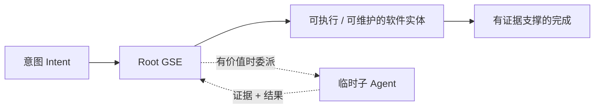

# 生成式软件工程（Generative Software Engineering）

[English](README.md) | **简体中文**

**生成式软件工程（Generative Software Engineering, GSE）** 将软件工作的基本单位定义为：把一个意图端到端地推进为可用、可维护的软件实体，并由同一个根 GSE 对最终结果负责。

```text
意图（Intent） → 可执行 / 可维护的软件实体（Executable / Maintainable Software Entity）
```

一个根 GSE Agent 负责完整闭环：理解意图、检查真实环境、定义结果契约、实现、验证、集成、交付和维护。当并行、专业能力或独立评估确有价值时，它可以把独立工作委派给临时子 Agent，但对最终结果的责任仍然保留在根 Agent。



GSE 由 **Longbiao CHEN（龙彪）** 提出并维护，作为一个开放的研究与工程方法体系。

> 本中文 README 用于快速理解 GSE。规范性定义仍由 [`docs/SPECIFICATION.md`](docs/SPECIFICATION.md) 及其所链接的单一职责文档维护。

## 从这里开始

- **定义与不变量：** [`docs/SPECIFICATION.md`](docs/SPECIFICATION.md)
- **端到端生命周期：** [`docs/LIFECYCLE.md`](docs/LIFECYCLE.md)
- **动态 Agent 协作：** [`docs/COLLABORATION.md`](docs/COLLABORATION.md)
- **证据驱动的完成：** [`docs/EVIDENCE.md`](docs/EVIDENCE.md)
- **最小充分工程：** [`docs/MINIMAL_SUFFICIENT_ENGINEERING.md`](docs/MINIMAL_SUFFICIENT_ENGINEERING.md)
- **对比研究：** [`research/BENCHMARK_PROTOCOL.md`](research/BENCHMARK_PROTOCOL.md)
- **完整案例：** [`examples/`](examples/)

## 为什么需要 GSE

当我们把“生成代码”误认为“交付软件”时，Agentic Software Development 很容易失败：补丁可以编译，但用户路径仍然不可用；测试可以通过，但真实安装环境仍然有问题；庞大的多 Agent 组织也可能带来比工程收益更高的协调成本。

因此，GSE 重点关注五件事：

1. **结果责任（Outcome ownership）** —— 一个根 GSE 对一个软件意图端到端负责。
2. **可恢复生命周期（Recoverable lifecycle）** —— 工作通过明确的结果、证据和交接状态持续推进，而不是只依赖聊天历史。
3. **风险塑造协作（Risk-shaped collaboration）** —— 只有独立工作确实值得并行时才动态创建子 Agent，不要求固定角色流水线。
4. **证据驱动完成（Evidence-driven completion）** —— 只有当证据覆盖了本次变更影响的行为与系统性质时，才可以宣称完成。
5. **最小充分工程（Minimal sufficient engineering）** —— 只增加当前需求和已证明风险真正需要的状态、抽象、测试、兼容路径和流程。

## GSE 改变了什么

| 常见的停止点 | GSE 追问的完成条件 |
| --- | --- |
| “代码已经生成了。” | 现在是否真的得到了可用、可维护的软件结果？ |
| “测试已经通过了。” | 这些测试真的证明了受影响的用户与系统行为吗？ |
| “子 Agent 已经完成了。” | 根责任主体是否已经完成集成和验证？ |
| “我们用了更多 Agent。” | 委派带来的质量或吞吐提升，是否足以抵偿协调成本？ |
| “我们加了一个更健壮的抽象。” | 这份复杂度是否由当前需求或已证明风险所需要？ |

## 仓库结构

- [`docs/SPECIFICATION.md`](docs/SPECIFICATION.md) —— GSE 的规范模型与不变量。
- [`docs/LIFECYCLE.md`](docs/LIFECYCLE.md) —— 任务生命周期、结果契约、续接与关闭。
- [`docs/COLLABORATION.md`](docs/COLLABORATION.md) —— 动态子 Agent 与并发写作者模型。
- [`docs/EVIDENCE.md`](docs/EVIDENCE.md) —— 证据层级与完成门槛。
- [`docs/MINIMAL_SUFFICIENT_ENGINEERING.md`](docs/MINIMAL_SUFFICIENT_ENGINEERING.md) —— 复杂度与测试价值约束。
- [`docs/HARNESS.md`](docs/HARNESS.md) —— GSE 语义与 Agent Harness / Runtime 的边界。
- [`templates/`](templates/) —— 轻量结果、交接和证据模板。
- [`examples/`](examples/) —— 完整案例。
- [`research/`](research/) —— 假设、Benchmark Protocol 与开放研究问题。
- [`CONTRIBUTING.md`](CONTRIBUTING.md) 与 [`AGENTS.md`](AGENTS.md) —— 本仓库的贡献与 Agent 工作规则。

仓库名 `generative-software-engineering` 是本项目有意保留的三段式 kebab-name 例外，它不定义通用的仓库命名规范。

## 当前状态

这个仓库是一个持续演进的研究与方法项目。规范层面会刻意保持精简：研究笔记可以提出变化，但只有正式提升进入 Specification 的内容才会改变当前 GSE 契约。

首个公开研究版本为 **v0.1**。研究计划本身应当可证伪：Benchmark 需要保留足够的信息，使不同方法能够公平比较，包括任务输入、基线、运行时 / 模型配置、工具权限、证据和所有参与者的总成本。

## 引用

如果 GSE 对你的研究、工程流程、教学或 Agent 设计产生了影响，欢迎引用本仓库。机器可读的引用元数据见 [`CITATION.cff`](CITATION.cff)。

```bibtex
@misc{chen2026gse,
  author = {Longbiao Chen},
  title = {Generative Software Engineering},
  year = {2026},
  url = {https://github.com/longbiaochen/generative-software-engineering}
}
```

## 许可证

GSE 使用双许可证：软件、可执行配置和 Agent Skill 产物采用 **Apache-2.0**；方法论文档、研究材料、模板、图表和案例采用 **CC BY 4.0**。完整条款见 [`LICENSE`](LICENSE) 与 [`LICENSES/`](LICENSES/)。

欢迎通过 Issues、Pull Requests 和 GitHub Discussions 参与贡献。提出规范性变更前，请先阅读 [`CONTRIBUTING.md`](CONTRIBUTING.md)。
